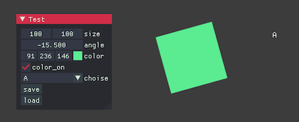

# ofxImGuiAuto



```cpp
ImGui::Begin("Test");

IMGUI_AUTOS2(
    size, 1.0f, 10.0f, 1000.0f, "%.0f",
    angle, 0.1f,
    color,
    color_on,
);
IMGUI_AUTO(choise);
IMGUI_AUTO_SAVE_LOAD(save(), load());

ImGui::End();
```

(see [example](./example/) for detail above.)

This addon provides macros named `IMGUI_AUTO`, `IMGUI_AUTOS`, `IMGUI_AUTOS2`, `IMGUI_AUTO_SAVE_LOAD` that automatically generate ImGui DragXXX controls and Save/Load buttons.

C++17 or higher is required.

Tested on oF v0.12.0 (win/mac)

## Dependencies

- [ofxImGui (develop branch)](https://github.com/jvcleave/ofxImGui/tree/develop)

## Features

- Automatically generates ImGui (Drag) controls for:
    - `float`
    - `int`
    - `ofVec2f`
    - `ofVec3f`
    - `ofRectangle`
    - `ofColor` (ColorEdit4)
    - `bool` (Checkbox)
    - `enum` (Combo)

## Example

### using IMGUI_AUTOS / IMGUI_AUTO (low overhead)

```cpp
class MyApp : public ofBaseApp {
public:
    ofVec2f position;
    ofVec2f size;
    float scale;
    ofVec2f offset;
    ofVec2f baseSize;
    float speed;
    float fadeIn;
    float duration;
    float fadeOut;
    bool enabled;

    void setup() {
        position = ofVec2f(0, 0);
        size = ofVec2f(100, 70);
        scale = 1.0f;
        offset = ofVec2f(10, 10);
        baseSize = ofVec2f(50, 50);
        speed = 1.0f;
        fadeIn = 0.5f;
        duration = 1.0f;
        fadeOut = 0.5f;
        enabled = true;
        load();
    }

    void save(){
        // something to save
    }

    void load(){
        // something to load
    }

    void drawGui() {
        ImGui::Begin("My Controls");
        IMGUI_AUTOS(
            position,
            size,
            scale,
            offset,
            baseSize,
            enabled
        );
        IMGUI_AUTO(speed, 0.1f);
        IMGUI_AUTO(fadeIn, 0.1f);
        IMGUI_AUTO(duration, 0.1f);
        IMGUI_AUTO(fadeOut, 0.1f);
        IMGUI_AUTO_SAVE_LOAD(save(), load(), "save", "load");

        // or short-hand:
        // IMGUI_AUTO_SAVE_LOAD(save(), load());

        ImGui::End();
    }
};
```

### using IMGUI_AUTOS2 (smarter)

```cpp
void drawGui() {
    ImGui::Begin("My Controls");
    IMGUI_AUTOS2(
        position,
        size,
        scale,
        offset,
        baseSize,
        enabled,
        speed, 0.1f,
        fadeIn, 0.1f,
        duration, 0.1f,
        fadeOut, 0.1f
    );
    IMGUI_AUTO_SAVE_LOAD(save(), load(), "save", "load");

    // or short-hand:
    // IMGUI_AUTO_SAVE_LOAD(save(), load());

    ImGui::End();
}
```

### IMGUI_AUTOS2 Limitations

- enum is treated as int (not becomes Combo)
- runtime overhead (parsing string on runtime, on every frame)

||IMGUI_AUTOS|IMGUI_AUTOS2
|-|-|-|
|enum|O|X|
|parameters|X (use `IMGUI_AUTO`)|O|
|overhead|low|middle|
|args limit|14|(infinite)|

## Note: for save/load

You can use any serializations as you like. 

I recommend [ofxJsonUtils](https://github.com/2bbb/ofxJsonUtils) and [ofxJsonUtilsUtils](https://github.com/nariakiiwatani/ofxjsonutilsutils).

ofxJsonUtilsUtils's `JSON_FUNCS` syntax will fit well `IMGUI_AUTOS` or `IMGUI_AUTOS2`.

## License

[0BSD](LICENSE)

(Please note that [magic_enum](https://github.com/Neargye/magic_enum) is [MIT License](https://github.com/Neargye/magic_enum/blob/master/LICENSE).)
